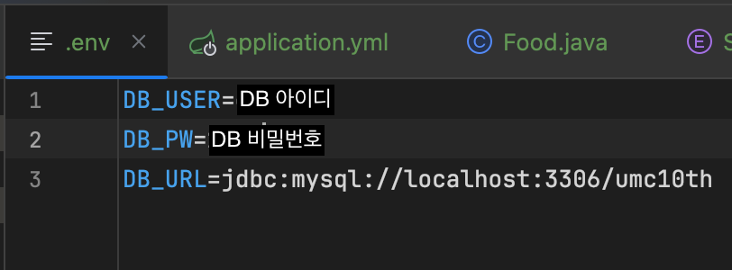
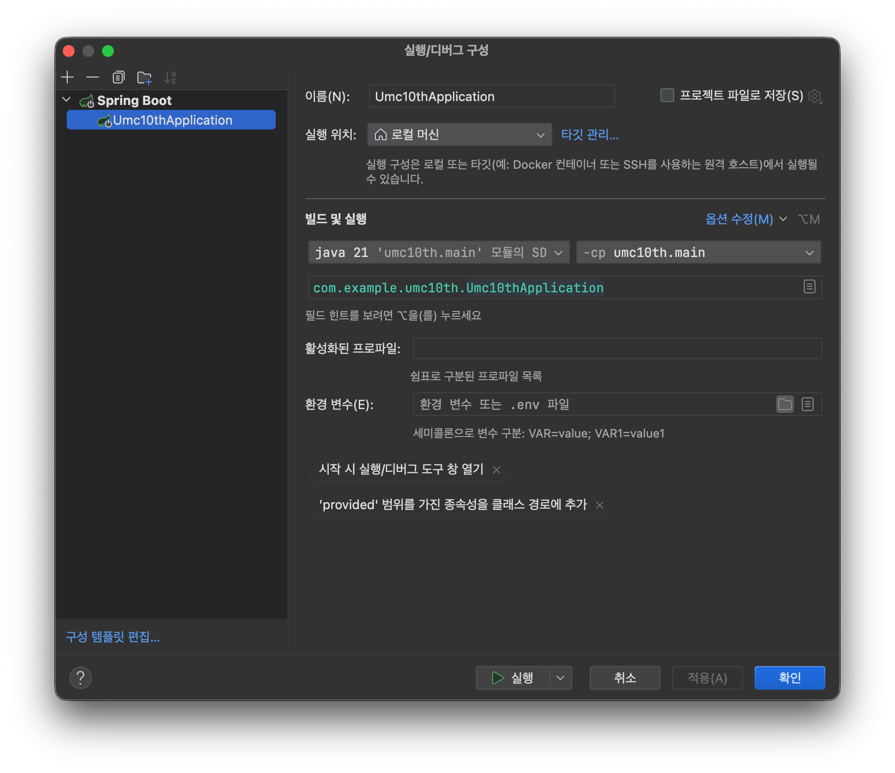

# AI-star-be
AI-star Backend: SW Engineering Project

## 배포 URL
- https://api-aistar.kro.kr/

## 실행 환경
- **Language:** Java 21
- **Build Tool:** Gradle
- **Framework:** Spring Boot 4.0.4

## 실행 방법

### 1. repository clone
```bash
git clone https://github.com/AI-star-CAU/AI-star-be.git
cd AI-star-be
```

### 2. 서버 실행

#### Mac / Linux 
```bash
./gradlew clean build
java -jar build/libs/ai-star-server.jar
```

#### Windows
```bash
gradlew clean build
java -jar build/libs/ai-star-server.jar
```


#### IntelliJ를 이용한 실행을 권장

## 실행 확인

- http://localhost:8080
- http://localhost:8080/health
- http://localhost:8080/hello

- 3가지 기본 테스트용 엔드포인트 (method: GET)


### 3. 데이터 베이스 설정 방법
- .env 생성
```
  DB_USER=사용자명
  DB_PW=db 비번
  DB_URL=db url
```

- 실행 -> 구성 편집
-  환경 변수를 띄운 다음 옆에 폴더 모양을 눌러 .env 파일을 설정


- DB에 들어가 ```CREATE DATABASE AIT``` 실행